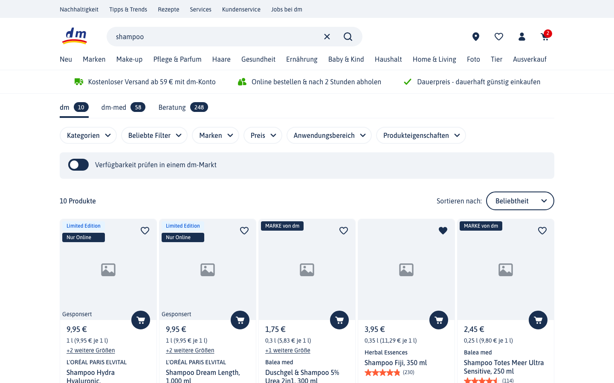
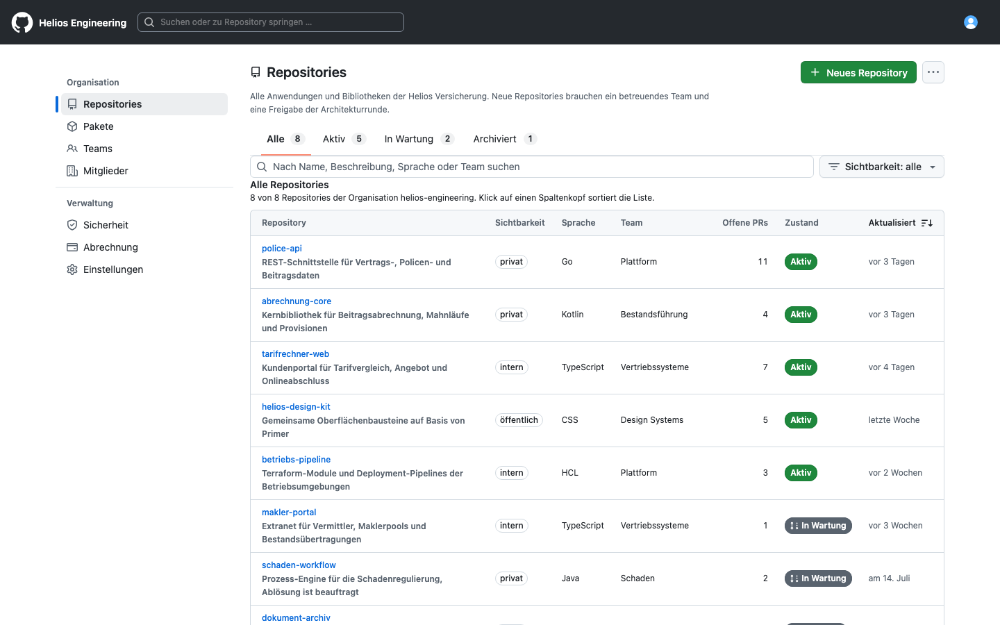
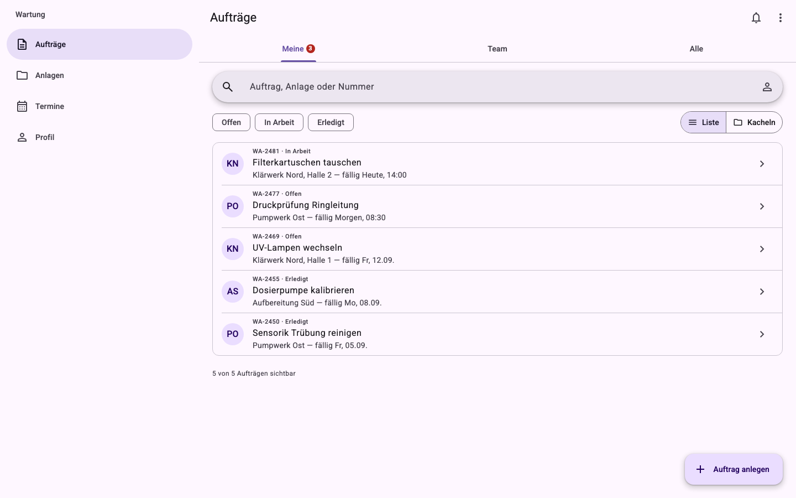

# brand-playground

**Turn any design system into your brand's playground.**

A Claude Code skill that compiles any design system — a live website, a code library, a Figma file, a spec, screenshots, or a mix — into a local prototyping kit: the design system compiler. Afterwards, one sentence describing a requirement goes in and a clickable prototype in your corporate design comes out.

## Show it

Three kits generated from public sources, each photographed at its reference screen — the screen the generator rebuilds from the original so you can judge fidelity before building on it.



**Live website → dm.de.** The site ships its design system as a versioned CSS bundle with 281 custom properties; the kit froze about 100 of them as tokens, built 29 components and 24 icons from the rendered DOM, and rebuilt two screens (search results, product detail) as the reference. Fonts substituted by metric comparison, documented in the kit.



**Code library → GitHub Primer (`@primer/react`).** Nothing is rebuilt: the package is pinned and imported directly. Its own metadata yields 78 components with props *and* story code, import paths verified against the type definitions. The reference is a typical application page from Primer's examples (repository list plus detail).



**Figma → Material 3 Design Kit.** The Figma file provided names and values via the Figma MCP; the machine-readable `@material/web` token files served as the deterministic cross-check (all overlapping values matched). Result: 28 components with state layers, 40 Material Symbols, a reference app with list, detail, and a component matrix.

**Try one without cloning:** the Material 3 kit is published as [brand-playground-example-material3](https://github.com/humanbird/brand-playground-example-material3) — its single-file export runs live at [humanbird.github.io/brand-playground-example-material3](https://humanbird.github.io/brand-playground-example-material3/), and the repo shows exactly what `/playground` leaves behind (`AGENTS.md`, `design/`, the skill, the reference prototype).

The example kits are reverse-engineered from public sources for demonstration. They are not affiliated with or endorsed by dm, GitHub, or Google, and the screens show fictional content.

## What you get

`/playground` produces a standalone repository next to this one (`../<ds>-playground`). It runs without this repository and without a network connection.

```
AGENTS.md                        canonical instructions for every agent (Claude, Cursor, Copilot, Codex)
CLAUDE.md                        two lines: imports AGENTS.md
README.md                        for humans: start, example requests, where to look, how to share
llms.txt                         entry-point index for any tool
.claude/skills/<ds>/SKILL.md     the one design-system skill: anatomy, layout, token rules, compositions
.claude/skills/<ds>/craft.md     design-system-independent craft (states, motion, anti-patterns)
.claude/skills/<ds>/pitfalls.md  everything that went wrong once; grows without limit
design/kit.json                  provenance stamp: template and framework commit the kit was built from
design/tokens.css                frozen tokens as CSS variables — never regenerated
design/tokens.json               DTCG source with provenance per token (source, confidence, usage, id)
design/components-meta.json      component inventory: props, variants, slots, status (verified/derived/estimated)
design/fonts.css, fixes.css      local @font-face blocks; documented micro-fixes
design/ingest/                   the evidence: report.md, assets.md, raw tokens, PROGRESS.md
src/components/<Name>.tsx        the design system's components in open code (or the pinned package)
src/icons/index.tsx              the frozen icon set
src/prototypes/<slug>/           directory = prototype = route; reference-<name>/ is the sign-off screen
```

Four things the kit guarantees:

1. **Frozen tokens with provenance.** Every value names its source and confidence. Estimated values are marked, never silently frozen.
2. **`components-meta.json` is the API source of truth.** A prop that is not in it does not exist; agents read the file instead of remembering.
3. **One distilled skill per design system**, under 500 lines, plus `craft.md`. It explains the system — page anatomy, grid, token rules, which component for what — not individual APIs.
4. **Offline single-file export.** `pnpm export` writes one HTML file with fonts and icons embedded; stakeholders click through without any setup.

Inside the kit, `pnpm dev` serves an auto-generated overview of every prototype with a desktop/mobile viewport toggle, creating a directory creates a route, and two working modes need no commands: describe a screen (proto) or ask for several directions side by side (ideate). `AGENTS.md` and `llms.txt` make the same kit usable from Cursor, Copilot, or any other agent.

## Quick start

Prerequisites, once per machine:

- [Claude Code](https://claude.com/claude-code), signed in
- Node.js 22.22 or newer and pnpm: `npm i -g pnpm`
- Only for Figma input: the Figma MCP server on a seat that can read the file — `claude mcp add --transport http figma-remote-mcp https://mcp.figma.com/mcp`

Compile a design system:

```bash
git clone https://github.com/humanbird/brand-playground.git
cd brand-playground
claude
```

```
/playground https://www.example.com
```

Name whatever you have: a URL, a Figma link, a package name or repository path, a spec file, a directory of screenshots — or several of these; the best source wins per token and component. The run ends with a sign-off: the reference screen next to the original, you compare, corrections flow back into the kit.

Then work in the kit only:

```bash
cd ../example-playground
claude
```

One sentence is enough — "A checkout with address, payment and confirmation, three screens, linked." To share a prototype, `pnpm export --only <slug>` produces a single file that opens offline.

The stack is derived from the input, never chosen up front: a design system that ships code brings its own framework (React or Vue templates exist; other frameworks are ported from the React conventions), everything else gets Vite + React + TypeScript + Tailwind with generated components. If the input is genuinely ambiguous — say, both React and Vue packages — the generator asks; you can also override it with a sentence in the request.

## How it compares

Tools in this space solve one segment each: ingestion, a consumption format, or a hosted end-to-end editor. brand-playground combines multi-input ingestion with a frozen local kit and a prototype loop, at the price of running inside Claude Code. Details in [docs/research/08-similar-projects.md](docs/research/08-similar-projects.md); vendor descriptions as of 2026-09.

| | Input | Output | Runs | Lock-in |
|---|---|---|---|---|
| **brand-playground** | live site, code library, Figma, specs, screenshots, mixed | local kit: frozen tokens, components, skill, `AGENTS.md`, single-file export | local (Claude Code) | none — plain files, MIT |
| Claude Design | imported design system | designs in a hosted canvas; auto-correction against the system | hosted | hosted canvas |
| v0 custom registries | a `registry.json` you publish | generated UI inside v0 | hosted (registry over HTTP/MCP) | v0 editor; registry format is open |
| Figma Make (Make Kits) | Figma library | prototypes inside Figma Make | hosted | Figma |
| extract-design-system | live CSS | tokens JSON, coverage audit (CLI/skill/MCP) | local | none |
| DESIGN.md generators | live site | one Markdown file with tokens, rules, rationale | local | none |
| Figma MCP + a rules file | Figma, per query | context for the agent at prompt time; nothing frozen, no components | local | Figma seat |

## Honest limits

- **Cost and time.** A `/playground` run takes 30–90 minutes and a large share of a plan's budget; it may hit a session limit before it finishes. Every phase is committed and checkpointed — run `/playground` on the existing directory and it resumes from the filesystem, not from memory.
- **Figma needs an MCP-capable seat**, and the Figma MCP returns values only for the nodes you query. Expect a second source (code, a live site, a spec) for structure.
- **Screenshot-only input yields low-confidence tokens.** They are marked as estimated in `tokens.json`; follow-up questions from the agent are normal there, not a bug.
- **Fidelity is a human decision.** There is no automatic gate: you sign off the reference screen against the original, once, and the foundation is frozen. Prototypes are exploration, not products.
- **Why Claude Code only?** Compiling a design system is judgment-heavy, multi-step agent work (ingestion subagents, browser inspection, arbitration between sources), and one deep integration was the honest choice. Everything the generator outputs is plain files that any agent can use.

## Roadmap

- Packaging as a Claude Code plugin (today the skill is project-local; you use it from this checkout)
- `registry.json` export for React kits, so v0, Cursor, and shadcn-compatible tools can consume a kit
- `DESIGN.md` projection of a kit, if the Google Labs format gains traction
- Refresh diffs: re-ingest a source and diff against the frozen tokens, with the owner deciding per change
- Screenshot ingestion with render comparison, and Figma views generated from prototypes for stakeholders

## Contributing

Bug reports and kit reports (what a generated kit got right or wrong — the first independent use exposes the gaps) go through the [issue templates](.github/ISSUE_TEMPLATE/). How to test a template or skill change before opening a pull request is in [CONTRIBUTING.md](CONTRIBUTING.md). The concept is in [docs/concept.md](docs/concept.md); the research that shaped it is in [docs/research/](docs/research/). Releases are listed in [CHANGELOG.md](CHANGELOG.md).

[MIT License](LICENSE)
